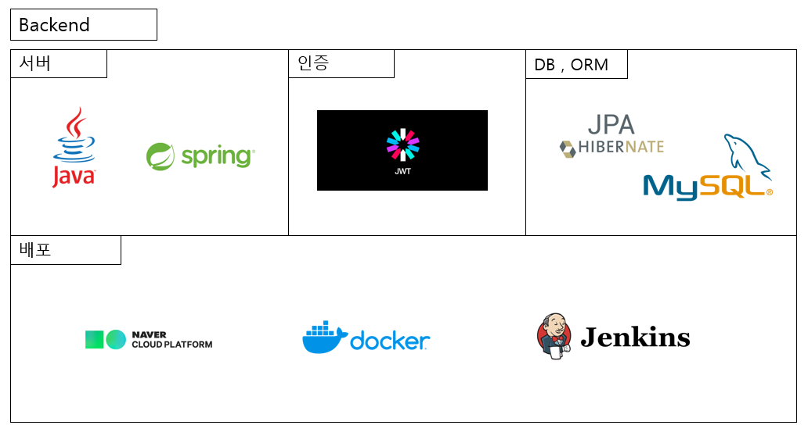
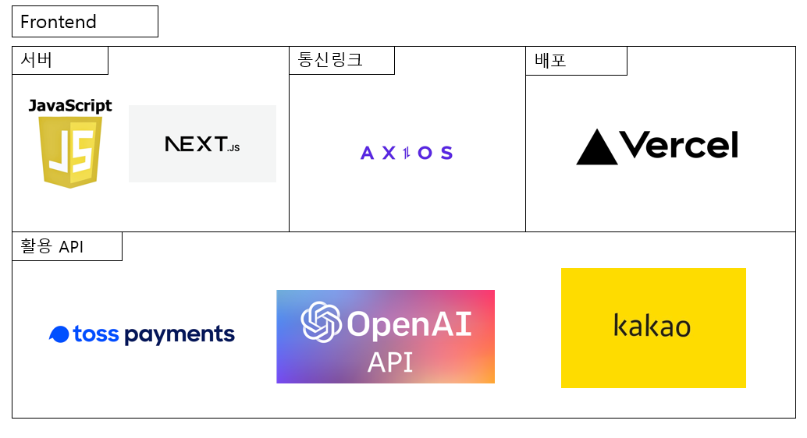
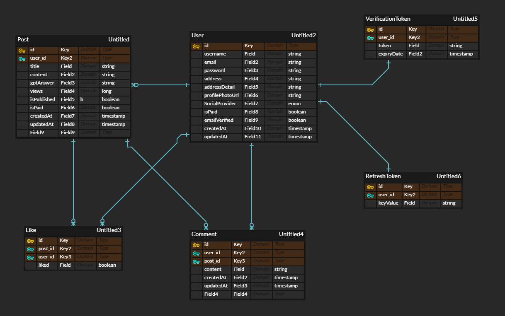

# 미디엄 클론 2차

## 1. 프로젝트 개요

* **미디엄은 블로그 플랫폼 이다.**
* **본인의 글을 유료화 할 수 있다.**
* **미디엄에 가입 이후에 유료 멤버십에 가입하면 유료글을 볼 수 있다.**
* **멤버십은 유지비용은 달에 2천원이다.**
* **미디엄은 한달에 한번 유료글 작성자에게 조회수를 기준으로 멤버십 수익의 일정부분을 캐시로 정산해준다.**
* **해당 캐시는 사이트내에서 돈처럼 사용가능하고 원할 때 환전할 수 있다.**
* **이번 후반기 미션에서는 멤버십기능, 정산기능을 구현한다.**

## 2. 사용한 기술 스택

## 3. 프로젝트 구조

## ERD (업데이트 예정)

## 4. 프로젝트 진행 상황

### 구현되어 있는 기능.

- [x] **회원 CRUD**
- [x] **게시글 CRUD**
- [x] **댓글 CRUD**
- [x] **결제 기능**
- [x] **유료 멤버십 적용**
- [x] **유료 글 적용**
- [x] **카카오 소셜로그인**
- [x] **마크다운 문법으로 보이게(상세, 리스트)**
- [x] **조회수 기능**
- [x] **추천 기능**

### 구현할 기능

- [] **검색 기능**
- [] **멤버쉽 정산 기능**

### 추가 기능

- [x] **GPT 질문 기능**
- [x] **이메일 인증 기능**
- [x] **주소 검색 기능**

## 5. 배포

- **프론트엔드 : Vercel, 백엔드: NCP** 
- [미디엄 클론 배포 링크](https://www.lionshop.me)
- **테스트용 아이디** :  
아이디, 비밀번호 동일!! test1 ~ test50 : 일반 유저 / test51 ~ test100 : 프리미엄 유저 
ex) 아이디 : test1 / 비밀번호 : test1